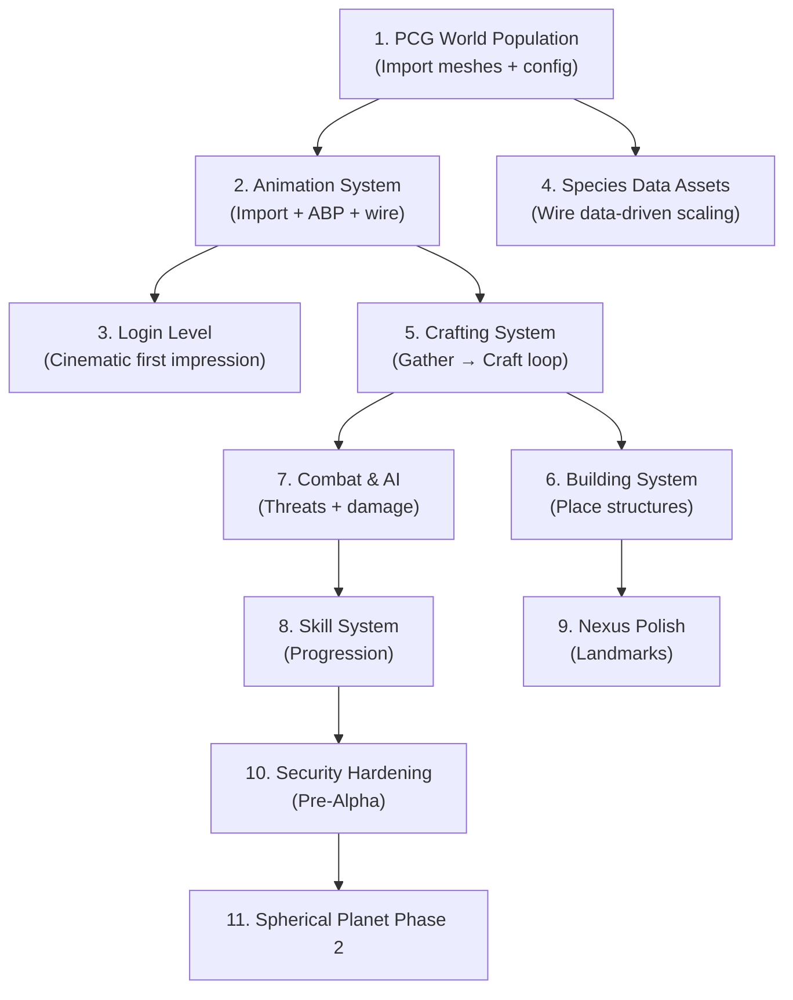

# Faldoran Prime MMO — Full Project Analysis & Remaining Work

**Date:** 2026-03-04 | **Studio:** Celtic Trinity Studios  
**Engine:** UE 5.7.1 Custom | **Stack:** C++ / PostgreSQL / Dedicated Server

---

## Table of Contents
1. [Executive Summary](#executive-summary)
2. [What's Done (Completed Systems)](#whats-done)
3. [What Still Needs Done (Gap Analysis)](#whats-remaining)
4. [Implementation Roadmap (Ordered Steps)](#implementation-roadmap)
5. [Ready-to-Paste Prompts](#prompts)

---

## Executive Summary

Faldoran Prime is an Earth-scale, procedurally generated MMO built in Unreal Engine 5.7.1 with a dedicated server architecture. The project has a **strong foundation** — core infrastructure (authentication, database, chunk-based terrain, PCG biome framework, inventory, flight, character creation) is in place and compiling.

**Current State:** ~35% of the way to a playable vertical slice.

### What's Solid
- Full login → character select → character creation → enter world pipeline
- Procedural terrain with biomes, rivers, water
- Tetris-style inventory with UI, click-to-place, rotation, split stacks, equipment slots
- Flight system with 5 speed tiers + terrain LOD shell
- Server-authoritative everything (positions, inventory, auth)
- PostgreSQL persistence for accounts, characters, affinities, inventory, equipment
- Position auto-save on logout

### Critical Gaps
- No animations (characters are T-posing or idle-only)
- No combat or damage system
- No crafting
- No building/construction
- No NPC spawning or AI
- No login level/cinematic (bare world)
- World population is framework-only (no real meshes assigned)
- Spherical planet Phase 2/3 not started

---

## What's Done

### ✅ Infrastructure & Security
| System | Status | Details |
|--------|--------|---------|
| PostgreSQL DB | ✅ Done | Remote, `characters`, `character_affinities`, `inventory`, `equipment` tables |
| Secret Management | ✅ Done | env vars → `ServerSecrets.ini` → `DefaultGame.ini`, no VCS leaks |
| Password Hashing | ✅ Done | Iterated SHA-256 (10k rounds), 256-bit crypto salt |
| Rate Limiting | ✅ Done | Login 5/60s, Account Creation 3/60s, 10-attempt lockout |
| Input Validation | ✅ Done | Server-side clamping at all RPC boundaries (256 char max) |
| Startup Gate | ✅ Done | `UFPMServerStartupGateSubsystem`: Starting → Holding → Ready → Running |
| DB Thread Safety | ✅ Done | `FCriticalSection` in `ExecuteQuery` |
| Log Categories | ✅ Done | Module-specific (no `LogTemp`) |

### ✅ World Engine
| System | Status | Details |
|--------|--------|---------|
| Chunk System | ✅ Done | Async generation, LOD tiers, Marching Cubes + Heightmap |
| Noise Composition | ✅ Done | Continent → Mountain → Ridge → Detail → Thermal erosion |
| Climate Engine | ✅ Done | Temperature/moisture, 11 biomes, altitude-aware |
| Biome PCG Framework | ✅ Done | HISM-based C++ spawner, `UFPMBiomePCGConfig` data asset, slope filtering |
| Rivers & Lakes | ✅ Done | Procedural carving, teal water shader |
| Nexus System | ✅ Done | `AFPMNexusManager`, spawn new chars at Nexus, PCG suppression radius |
| Safety Floor | ✅ Done | `BuildSafetyFloorAt()` — prevents fall-through on spawn |
| Geodetic Coordinates | ✅ Done | `FFPMGeoCoord`, Haversine, 3D sphere noise coords |

### ✅ Character & Player
| System | Status | Details |
|--------|--------|---------|
| CC5 Pipeline | ✅ Done | 240+ morph targets, male/female mesh swap, 3D preview actor |
| Species Scaling | ✅ Done | `ApplySpeciesScaling()` — capsule, mesh, speed, camera boom |
| Replicated Appearance | ✅ Done | Name, BodyType, Species, SkinTone, EyeColor, HairColor, 4 facial morphs |
| Character Creation UI | ✅ Done | Tabbed Glass & Gold theme, species/body/face/hair/affinities |
| Character Creation Backend | ✅ Done | `UFPMCharacterCreationSubsystem` — validation, rate limit, DB insert |
| Character Select UI | ✅ Done | List view, Enter World / Create New / Back buttons |

### ✅ Gameplay Systems
| System | Status | Details |
|--------|--------|---------|
| Inventory Backend | ✅ Done | `UFPMInventoryComponent` — 2D grid (variable), AABB placement, rotation, stacking |
| Inventory UI | ✅ Done | Click-to-pick, R to rotate, ghost overlay, rarity borders, split stacks |
| Equipment Slots | ✅ Done | 24 piecemeal body slots (`EFPMEquipSlot`), UI widgets |
| Inventory Persistence | ✅ Done | `LoadFromDB` / `SaveToDB` for both inventory + equipment |
| Interaction System | ✅ Done | `IFPMInteractionInterface` + `UFPMInteractionComponent`, 10Hz line-trace |
| Interactable Resources | ✅ Done | `AFPMInteractableResource` base class |
| Flight System | ✅ Done | `UFPMPlanetTraversal` — 5 tiers (Hover→Rift), LOD terrain shell |

### ✅ UI Systems
| System | Status | Details |
|--------|--------|---------|
| Login Widget | ✅ Done | Glass & Gold, breathing glow, `BackgroundTexture` property |
| Character Select | ✅ Done | Programmatic Glass & Gold |
| Character Creation | ✅ Done | Tabs, 3D preview, affinity sliders |
| ESC Menu | ✅ Done | Resume / Logout & Save, status messages |
| HUD | ✅ Done | `AFPMHUD`, Canvas-drawn |
| Inventory Grid | ✅ Done | Full C++ widget with equipment panel |

### ✅ Persistence
| System | Status | Details |
|--------|--------|---------|
| Position Save on Logout | ✅ Done | `AFPMGameMode::Logout()` saves spawn_x/y/z to DB |
| Inventory Save on Logout | ✅ Done | Called from Logout alongside position save |
| Inventory Load on Enter World | ✅ Done | Called from `ServerRequestEnterWorld` |

---

## What's Remaining

### 🔴 Critical (Blocks Vertical Slice)

#### 1. Animation System — **NO ANIMATIONS**
- **Impact:** Characters T-pose or play a single idle. No walk/run/jump visible.
- **What exists:** `UFPMCharacterAnimInstance` (C++ base class). `CC5IdleAnimation` is loaded.
- **What's missing:**
  - [ ] Import Idle, Walk, Run, Jump Start/Loop/Land animations (Mixamo → CC5 retarget)
  - [ ] Create `ABP_CC5_Character` Animation Blueprint with state machine
  - [ ] Switch `AFPMPlayerCharacter` from SingleNode to AnimationBlueprint mode
  - [ ] Remove `CC5IdleAnimation` single-node playback
  - [ ] IK retarget across species heights

#### 2. PCG World Population — **EMPTY WORLD**
- **Impact:** The world is bare terrain — no trees, rocks, grass, or visual density.
- **What exists:** `UFPMBiomePCGConfig` data asset class + `FPMBiomePCGSpawner` C++ spawner
- **What's missing:**
  - [ ] Import tree meshes (2-3 varieties with LODs) → `Content/Environment/Trees/`
  - [ ] Import rock meshes (2-3 varieties) → `Content/Environment/Rocks/`
  - [ ] Create `DA_BiomePCGConfig` data asset and populate biome arrays
  - [ ] Assign to `AFPMWorldChunkManager` instance
  - [ ] Test and tune density/scale/slope per biome

#### 3. Login Level — **NO FIRST IMPRESSION**
- **Impact:** Players launch into a default/bare level. No cinematic wow factor.
- **What exists:** `AFPMLoginCinematicCamera` + `AFPMLoginLevelSetup` (compiled, untested)
- **What's missing:**
  - [ ] Create `Content/Maps/L_LoginLevel`, set as Game Default Map
  - [ ] Spawn `AFPMWorldChunkManager` in login level for 3D world behind UI
  - [ ] Import splash art / configure background
  - [ ] Slow-panning camera over mountain + forest at golden hour
  - [ ] Make login widget background transparent/glass so 3D world shows through

#### 4. Species Data Assets — **DATA-DRIVEN SCALING NOT WIRED**
- **Impact:** Species selection works but reads from a hardcoded fallback array, not data assets.
- **What exists:** `UFPMSpeciesDataAsset` + `UFPMSpeciesRegistry` class definitions. `SpeciesRegistry` UPROPERTY on player character ready to be assigned.
- **What's missing:**
  - [ ] Create `DA_Species_*` data assets (9 species) in `Content/Data/Species/`
  - [ ] Create `DA_SpeciesRegistry` and populate it
  - [ ] Assign registry to `BP_PlayerCharacter` class defaults
  - [ ] Refactor `ApplySpeciesScaling()` to read from registry instead of static array

---

### 🟡 Important (Needed for First Gameplay Loop)

#### 5. Crafting System — **NOT STARTED**
- **Impact:** No way to combine gathered resources into anything useful.
- **Design:** [10_Dynamic_Crafting_and_Templates.md](file:///e:/FaldoranPrimeMMO/Documents/Design/10_Dynamic_Crafting_and_Templates.md)
- **What's missing:**
  - [ ] `FFPMCraftingRecipe` struct (data-driven: inputs, output, craft time)
  - [ ] `UFPMCraftingComponent` on player: `KnownRecipes`, `CanCraft()`, `Craft()` (server-authoritative)
  - [ ] Simple crafting UI showing available recipes
  - [ ] Starter recipes: Rock→Stone Axe, Wood→Wooden Shield, Rock+Wood→Campfire
  - [ ] DB persistence for known recipes (future)

#### 6. Building System — **NOT STARTED**
- **Impact:** No player structures, camps, or settlements possible.
- **Design:** [05_Building_and_Settlements.md](file:///e:/FaldoranPrimeMMO/Documents/Design/05_Building_and_Settlements.md)
- **What's missing:**
  - [ ] `AFPMPlaceableStructure` base class (replicated)
  - [ ] `UFPMBuildingComponent`: ghost preview, grid snap, collision/slope check
  - [ ] Green=valid/Red=invalid placement visualization
  - [ ] Left Click = place (server-authoritative spawn + consume inventory items)
  - [ ] 3 test structures: Campfire, Wooden Wall, Foundation
  - [ ] Territory/protection system (long-term)

#### 7. Combat & AI — **NOT STARTED**
- **Impact:** No threats, no danger, no reason to craft weapons.
- **Design:** [06_Gear_and_Combat.md](file:///e:/FaldoranPrimeMMO/Documents/Design/06_Gear_and_Combat.md)
- **What's missing:**
  - [ ] Affinity → stats pipeline (6 Playstyle + 8 Magical values → concrete HP/damage/etc.)
  - [ ] Basic melee hit detection (line trace / overlap)
  - [ ] Damage system: `DamageStatus` + `DurabilityStatus` dual model
  - [ ] Health/stamina/mana HUD elements
  - [ ] NPC spawning: biome-constrained, dynamic, safe-zone exclusion (Nexus radius exists)
  - [ ] Basic NPC AI: patrol, aggro, attack, disengage
  - [ ] Death system: Soul Debt, inventory drop chances per region type

#### 8. Skill System — **NOT STARTED**
- **Impact:** No progression, no "becoming better at things."
- **Design:** [13_Skills_and_Abilities.md](file:///e:/FaldoranPrimeMMO/Documents/Design/13_Skills_and_Abilities.md) — **189 skills across 12 categories** defined.
- **What's missing:**
  - [ ] `FFPMSkill` struct: SkillID, Rank (permanent), CurrentXP, WisdomFloor, bDiscovered
  - [ ] `UFPMSkillComponent` on player (server-authoritative)
  - [ ] XP gain on action (use-based discovery)
  - [ ] Rusty Master system: XP decay, Wisdom Floor, quality penalties
  - [ ] Skill discovery (hidden until used/trained/observed)
  - [ ] DB persistence for skill state
  - [ ] Skills UI panel

---

### 🟢 Future/Polish (Not Blocking Vertical Slice)

#### 9. Spherical Planet Phase 2 — **DESIGNED, NOT STARTED**
- [ ] Noise sampling via 3D sphere projection end-to-end (bypass flat XY)
- [ ] `WorldChunkManager` tracks player as `FFPMGeoCoord`
- [ ] Chunk gather uses adaptive lon-cells per latitude band
- [ ] DB migration: `spawn_lat / spawn_lon / spawn_alt` columns

#### 10. Spherical Planet Phase 3 — **DESIGNED, NOT STARTED**
- [ ] Orbital camera / space transition at 100km altitude
- [ ] Planet-scale LOD shell visible from orbit

#### 11. Nexus Polish
- [ ] Place Nexus marker/landmark mesh at (0,0) — placeholder rocks/ruins
- [ ] Multiple Nexuses (one per continent, driven by seed)

#### 12. Security Hardening (Pre-Alpha Checklist)
- [ ] TLS/SSL for all client-server communication
- [ ] Upgrade to bcrypt / Argon2 password hashing
- [ ] Session token system with expiry
- [ ] IP-based throttling and auto-ban
- [ ] Server-side cheat detection
- [ ] Penetration testing

#### 13. Maritime System — [12_Maritime_and_Sea_Crossings.md](file:///e:/FaldoranPrimeMMO/Documents/Design/12_Maritime_and_Sea_Crossings.md)
- Ship building, crew system, scale dilation, Crystal Cores

#### 14. NPC Factions & Standing — [08_NPC_Factions_and_Standing.md](file:///e:/FaldoranPrimeMMO/Documents/Design/08_NPC_Factions_and_Standing.md)
- Global/Regional standing, hireling system, strikes/sabotage

#### 15. Logic & Automation — [09_Logic_and_Automation.md](file:///e:/FaldoranPrimeMMO/Documents/Design/09_Logic_and_Automation.md)
- Mana Crystal powered automation, complexity limits

#### 16. Mounts & Caravans — [14_Mounts_and_Caravans.md](file:///e:/FaldoranPrimeMMO/Documents/Design/14_Mounts_and_Caravans.md)
- Beast taming, selective breeding, caravan trade routes

#### 17. Titles & Professions — [15_Titles_and_Professions.md](file:///e:/FaldoranPrimeMMO/Documents/Design/15_Titles_and_Professions.md)
- Reputation-based titles, profession mastery tiers

#### 18. Resource Surveying — [11_Resource_Surveying_and_Geology.md](file:///e:/FaldoranPrimeMMO/Documents/Design/11_Resource_Surveying_and_Geology.md)
- Deep mining, shaft elevators, infestation dungeons

---

## Implementation Roadmap

> [!IMPORTANT]
> Steps are ordered by dependency and impact. Each step is a single chat session per the project's workflow rules.



| Step | Task | Type | Est. Sessions | Dependencies |
|------|------|------|--------------|--------------|
| **1** | PCG World Population | 👤 Editor | 1 | None |
| **2A** | Import Animations | 👤 Editor | 1 | None |
| **2B** | Create Animation Blueprint | 👤 Editor | 1 | 2A |
| **2C** | Wire AnimBP to Player Character | 🤖 Code | 1 | 2B |
| **3** | Login Level Showcase | 🤖+👤 | 1 | 1 |
| **4A** | Create Species Data Assets | 👤 Editor | 1 | None |
| **4B** | Wire Species Registry | 🤖 Code | 1 | 4A |
| **5** | Crafting System | 🤖 Code | 1-2 | Inventory ✅ |
| **6** | Building System | 🤖 Code | 1-2 | 5 |
| **7A** | Stats Pipeline | 🤖 Code | 1 | None |
| **7B** | Basic Combat + Damage | 🤖 Code | 1-2 | 7A |
| **7C** | NPC Spawning + AI | 🤖 Code | 2-3 | 7B |
| **8** | Skill System | 🤖 Code | 2-3 | 7 |
| **9** | Nexus Landmarks | 👤 Editor | 1 | 1 |
| **10** | Security Hardening | 🤖 Code | 2-3 | All gameplay |

**Legend:** 👤 = Manual/Editor work | 🤖 = Agent-assisted code | Sessions = ~1 focused chat each

---

## Ready-to-Paste Prompts

> [!TIP]
> Each prompt below is a self-contained agent task. Copy-paste the entire code block as your opening message in a new chat session. The existing [Agent_Prompt_Library.md](file:///e:/FaldoranPrimeMMO/Documents/Workflows/Agent_Prompt_Library.md) covers Steps 1-9. Below is an **updated and expanded** version reflecting current project state.

---

### STEP 1 — PCG World Population (👤 Editor)

> [!NOTE]
> This is a manual editor step. No agent prompt needed.

1. Import tree meshes (2-3 varieties with LODs) → `Content/Environment/Trees/`
2. Import rock meshes (2-3 varieties) → `Content/Environment/Rocks/`
3. Right-click in Content Browser → Data Asset → `UFPMBiomePCGConfig` → name `DA_BiomePCGConfig`
4. Fill biome arrays: Meadows (grass, sparse trees), Forest (dense trees), Mountains (rocks)
5. Select `AFPMWorldChunkManager` in level → assign `DA_BiomePCGConfig`
6. Play and verify vegetation spawns correctly

---

### STEP 2A — Import Animations (👤 Editor)

> [!NOTE]
> Manual step. Download from Mixamo.com.

1. Go to Mixamo.com → download: Idle, Walk, Run, Jump Start, Jump Loop, Jump Land
2. Import to `Content/Characters/CC5/Animations/`
3. IK Retarget if source skeleton differs from CC5 skeleton

---

### STEP 2B — Create Animation Blueprint (👤 Editor)

> [!NOTE]
> Manual step in Unreal Editor.

1. Right-click → Animation → Animation Blueprint
2. Parent Class: `UFPMCharacterAnimInstance`, Skeleton: CC5
3. Name: `ABP_CC5_Character`
4. State Machine: Idle → Walk/Run (Speed > 10) → JumpStart (bIsJumping) → JumpLoop → JumpLand → Idle

---

### STEP 2C — Wire Animation Blueprint to Player Character (🤖 Code)

```
CONVERSATION TITLE: Wire Animation Blueprint to Player Character

CONTEXT:
Read before starting:
- Source/FaldoranPrimeMMO/Public/Player/FPMPlayerCharacter.h
- Source/FaldoranPrimeMMO/Private/Player/FPMPlayerCharacter.cpp
- Source/FaldoranPrimeMMO/Public/Character/Animation/FPMCharacterAnimInstance.h

UFPMCharacterAnimInstance (C++ anim instance base) exists and exposes
Speed and bIsJumping properties for the state machine.
ABP_CC5_Character has been created in the editor (Step 2B).
Player currently uses AnimationSingleNode mode with CC5IdleAnimation.

TASK: Switch AFPMPlayerCharacter to use AnimationBlueprint mode.

REQUIREMENTS:
1. Change animation mode to AnimationBlueprint in the constructor
2. Set AnimBP class on the skeletal mesh component (soft reference to ABP_CC5_Character)
3. Remove the CC5IdleAnimation single-node playback code
4. Keep the CC5MaleMesh and CC5FemaleMesh loading (those are still needed)
5. Build both Editor and Server targets — both must succeed
6. Do NOT break any existing functionality (species scaling, appearance, inventory, etc.)

Validation: Build succeeds. Walk/run trigger correct animations. Jump animations work.
```

---

### STEP 3 — Login Level Showcase (🤖 Code + 👤 Editor)

```
CONVERSATION TITLE: Login Level Showcase

CONTEXT:
Read before starting:
- Source/FaldoranPrimeMMO/Public/World/FPMLoginCinematicCamera.h
- Source/FaldoranPrimeMMO/Public/World/FPMLoginLevelSetup.h
- Source/FaldoranPrimeMMO/Public/UI/FPMLoginWidget.h
- Documents/Workflows/Reference/Login_Screen_Cinematic_Guide.md

AFPMLoginCinematicCamera + AFPMLoginLevelSetup are compiled but untested.
FPMLoginWidget has a BackgroundTexture property and breathing glow animation.
Login screen currently shows static/default background.

TASK: Set up a cinematic 3D world view behind the login UI.

REQUIREMENTS:
1. Create or modify the Login level — add AFPMWorldChunkManager for live terrain
2. Configure a slow-panning camera orbiting over mountain + forest terrain at golden hour
3. Make the FPMLoginWidget background transparent / glassmorphism so the 3D world shows through
4. Set up a Directional Light with golden hour angle (sun near horizon, warm tone)
5. Set L_LoginLevel as the Game Default Map in project settings
6. Build both Editor and Server targets

Validation: Game launch → login screen with live procedural 3D world slowly rotating behind the Glass & Gold UI.
```

---

### STEP 4A — Create Species Data Assets (👤 Editor)

> [!NOTE]
> Manual editor step.

Create these Data Assets in `Content/Data/Species/`:

| Asset | Species | MeshScale | CapsuleHH | CapsuleR | WalkSpeed | BoomLen |
|-------|---------|-----------|-----------|----------|-----------|---------|
| DA_Species_Human | Human | 1.0 | 90 | 34 | 1.00 | 400 |
| DA_Species_HalfElf | HalfElf | 1.05 | 94 | 34 | 1.02 | 420 |
| DA_Species_Elf | Elf | 1.08 | 97 | 32 | 1.05 | 440 |
| DA_Species_Dwarf | Dwarf | 0.80 | 72 | 38 | 0.90 | 320 |
| DA_Species_Halfling | Halfling | 0.65 | 58 | 30 | 0.85 | 260 |
| DA_Species_HalfOrc | HalfOrc | 1.15 | 103 | 40 | 0.95 | 460 |
| DA_Species_Gnome | Gnome | 0.55 | 50 | 26 | 0.80 | 220 |
| DA_Species_Kethari | Kethari | 0.95 | 86 | 32 | 1.10 | 380 |
| DA_Species_Rauken | Rauken | 1.10 | 99 | 38 | 1.05 | 440 |

Then create `DA_SpeciesRegistry` and add all 9 species assets to the `Species` array.

---

### STEP 4B — Wire Species Data Assets to Player Character (🤖 Code)

```
CONVERSATION TITLE: Wire Species Data Assets to Player Character

CONTEXT:
Read before starting:
- Source/FaldoranPrimeMMO/Public/Character/FPMSpeciesDataAsset.h
- Source/FaldoranPrimeMMO/Public/Player/FPMPlayerCharacter.h
- Source/FaldoranPrimeMMO/Private/Player/FPMPlayerCharacter.cpp

UFPMSpeciesDataAsset and UFPMSpeciesRegistry already exist in
Public/Character/FPMSpeciesDataAsset.h.
AFPMPlayerCharacter already has a UPROPERTY SpeciesRegistry.
ApplySpeciesScaling() currently reads from a static FSpeciesScaling array
as a fallback.
DA_Species_* data assets and DA_SpeciesRegistry created in editor (Step 4A).

TASK: Refactor ApplySpeciesScaling() to prefer the UFPMSpeciesRegistry.

REQUIREMENTS:
1. If SpeciesRegistry is assigned and has the species, read MeshScale,
   CapsuleHalfHeight, CapsuleRadius, WalkSpeedMultiplier,
   CameraBoomLength, DefaultMorphTargets from the data asset
2. Keep old static array as fallback if SpeciesRegistry is null
3. Log a warning if SpeciesRegistry is null (so devs notice)
4. Build Editor + Server targets — both must succeed
5. Do NOT break existing appearance/inventory/flight systems

Validation: Build succeeds. Human species works identically to before.
Dwarf is visibly shorter.
```

---

### STEP 5 — Crafting System (🤖 Code)

```
CONVERSATION TITLE: Crafting System

CONTEXT:
Read before starting:
- Source/FaldoranPrimeMMO/Public/Gameplay/FPMInventoryComponent.h
- Source/FaldoranPrimeMMO/Public/Gameplay/FPMInteractableResource.h
- Documents/Design/10_Dynamic_Crafting_and_Templates.md

UFPMInventoryComponent has AddItem/RemoveItem/HasItem.
AFPMInteractableResource handles gathering. Items identified by FName ItemID.
Server-authoritative inventory is fully working with DB persistence.

TASK: Implement data-driven crafting system.

REQUIREMENTS:
1. FFPMCraftingRecipe struct:
   - TArray<TPair<FName,int32>> Inputs (ItemID + count)
   - FName OutputItemID
   - int32 OutputCount
   - float CraftTime (seconds)
   - FName RecipeID for lookup
2. UFPMCraftingComponent (ActorComponent on player):
   - TArray<FFPMCraftingRecipe> KnownRecipes
   - CanCraft(recipe) — checks inventory has all inputs
   - Craft(recipe) — server-authoritative: verify, consume inputs, add output
   - Replicated: COND_OwnerOnly
3. Simple crafting UI widget:
   - List of known recipes with input/output display
   - "Craft" button (grayed out if CanCraft is false)
   - Progress bar during CraftTime
4. Starter recipes (populated in BeginPlay or from data asset):
   - 3 Rock → Stone Axe (1×2 size)
   - 5 Wood → Wooden Shield (2×2 size)
   - 2 Rock + 3 Wood → Campfire (2×2 size)
5. Keybind: C key to open/close crafting UI
6. Build Editor + Server targets

Validation: Gather rocks/wood → C key → craft Stone Axe →
inputs consumed, output appears in inventory grid.
```

---

### STEP 6 — Building System (🤖 Code)

```
CONVERSATION TITLE: Building System Foundation

CONTEXT:
Read before starting:
- Source/FaldoranPrimeMMO/Public/Gameplay/FPMInventoryComponent.h
- Documents/Design/05_Building_and_Settlements.md

Inventory, crafting, and interaction systems exist and work.
Server-authoritative model for all gameplay actions.

TASK: Implement basic building placement system.

REQUIREMENTS:
1. AFPMPlaceableStructure base class (replicated Actor):
   - Static mesh, placement cost (TArray<TPair<FName,int32>>)
   - Health, owning player reference
2. UFPMBuildingComponent (ActorComponent on player):
   - EnterBuildMode(StructureClass) — show ghost preview
   - Ghost follows camera line trace, snaps to grid (100cm)
   - Green material = valid placement, Red = invalid (collision/slope)
   - Left Click = place (consume items, server spawns actor)
   - Right Click / Escape = cancel build mode
3. 3 test placeable structures:
   - Campfire (1x1, cost: 1 Campfire item)
   - Wooden Wall (1x2, cost: 5 Wood)
   - Foundation (2x2, cost: 8 Rock + 4 Wood)
4. Server-authoritative: client sends placement request, server validates
   inventory, collision, slope, then spawns the actor
5. Keybind: B key to toggle build menu
6. Build Editor + Server targets

Validation: Craft campfire → B key → select campfire → ghost preview
follows cursor → place on ground → visible to all connected players.
```

---

### STEP 7A — Stats Pipeline (🤖 Code)

```
CONVERSATION TITLE: Affinity to Stats Pipeline

CONTEXT:
Read before starting:
- Source/FaldoranPrimeMMO/Public/Character/FPMCharacterCreationDataContract.h
  (EFPMPlaystyleAffinity, EFPMMagicalAffinity, pools)
- Documents/Design/03_Progression_and_Attributes.md
- Documents/Design/00_Rules_and_Constraints.md (Sections on Weight, Affinities)

Characters already have 6 playstyle affinities (600 pool) and 8 magical
affinities (800 pool) persisted in the character_affinities DB table.
There is currently no runtime mapping from these affinities to actual
gameplay stats.

TASK: Create the affinity → derived stats pipeline.

REQUIREMENTS:
1. FFPMDerivedStats struct:
   - float MaxHP, MaxStamina, MaxMana
   - float MeleeAttackPower, RangedAttackPower
   - float MagicPower, HealingPower
   - float PhysicalDefense, MagicalDefense
   - float MoveSpeedMultiplier
2. UFPMStatsComponent (ActorComponent on player, replicated):
   - Stores base affinities + derived stats
   - RecalculateStats() — maps affinities to stats using formulas
   - Current HP/Stamina/Mana with regen logic
3. Formulas (simple linear for now):
   - Martial affinity → MeleeAttackPower, PhysicalDefense
   - Ranged affinity → RangedAttackPower
   - Magic affinity → MagicPower, MaxMana
   - Survival affinity → MaxHP, MaxStamina
   - Social affinity → (placeholder, no combat effect yet)
   - Crafting affinity → (placeholder)
4. Load affinities from DB when character enters world
5. Build Editor + Server targets

Validation: Build succeeds. Enter world → check logs for derived stats
matching affinity distribution.
```

---

### STEP 7B — Basic Combat + Damage (🤖 Code)

```
CONVERSATION TITLE: Basic Melee Combat and Damage System

CONTEXT:
Read before starting:
- The stats pipeline from Step 7A (UFPMStatsComponent)
- Source/FaldoranPrimeMMO/Public/Gameplay/FPMInventoryComponent.h
  (FFPMItemDefinition.Rarity, equipment slot system)
- Documents/Design/06_Gear_and_Combat.md

UFPMStatsComponent exists with MaxHP, current HP, attack/defense values.
Equipment system exists with 24 body slots.

TASK: Implement basic melee combat.

REQUIREMENTS:
1. Left Mouse Button = melee swing (server RPC)
2. Server performs sphere trace in front of player
3. If hits another player or NPC: calculate damage using attacker's
   MeleeAttackPower vs defender's PhysicalDefense
4. Apply damage to defender's HP via UFPMStatsComponent
5. Death at HP <= 0: ragdoll, apply Soul Debt (XP debt), respawn at
   nearest Nexus after timer
6. Basic hit feedback: camera shake, damage number popup
7. Attack cooldown (0.8s between swings, server-enforced)
8. Build Editor + Server targets

Validation: Two players in PIE. Player A hits Player B. B takes damage.
At 0 HP, B ragdolls and respawns at Nexus.
```

---

### STEP 7C — NPC Spawning + Basic AI (🤖 Code)

```
CONVERSATION TITLE: Biome-Based NPC Spawning and Basic AI

CONTEXT:
Read before starting:
- Source/FaldoranPrimeMMO/Public/World/FPMWorldChunkManager.h
  (GetBiomeAtWorldPos, Nexus safe zone system)
- The combat/damage system from Step 7B
- Documents/Design/00_Rules_and_Constraints.md (Monster Spawning section)

World chunks know their biome. AFPMNexusManager::IsInNexusSafeZone() exists.
Combat and damage pipeline are working.

TASK: Implement biome-constrained NPC spawning with basic AI.

REQUIREMENTS:
1. AFPMNPCCharacter base class (ACharacter, server-spawned):
   - HP, attack damage, aggro range, leash range
   - AI Controller with behavior tree
2. UFPMNPCSpawnManager (subsystem or component on WorldChunkManager):
   - Spawn NPCs per-chunk based on biome type
   - Max NPCs per chunk (density cap)
   - No spawning inside Nexus safe radius
   - Despawn when chunk unloads
3. Basic behavior tree:
   - Idle → Patrol (random waypoints within chunk)
   - Aggro (player enters range) → Chase → Attack
   - Disengage when player leaves leash range
   - Return to patrol
4. 3 starter NPC types:
   - Wolf (Meadows/Forest, fast, low HP)
   - Bear (Forest/Mountains, slow, high HP)
   - Skeleton (everywhere, medium)
5. Placeholder meshes (UE mannequin or primitive shapes)
6. Build Editor + Server targets

Validation: Fly to a Forest biome → wolves/bears spawn. Enter aggro range →
they chase and attack. Kill them → they drop loot. None spawn at Nexus.
```

---

### STEP 8 — Skill System (🤖 Code)

```
CONVERSATION TITLE: Skill Discovery and Progression System

CONTEXT:
Read before starting:
- Documents/Design/13_Skills_and_Abilities.md (189 skills, 12 categories)
- Documents/Design/00_Rules_and_Constraints.md (Rusty Master Rule)
- Documents/Design/03_Progression_and_Attributes.md

No skill system exists yet. Characters have affinities from creation
but no way to grow through gameplay.

TASK: Implement the core skill progression framework.

REQUIREMENTS:
1. FFPMSkillDef struct: SkillID (FName), Category, DisplayName,
   MaxRank, XPPerRank curve
2. FFPMSkillState struct: SkillID, CurrentRank (permanent),
   CurrentXP, WisdomFloor, bDiscovered, LastUsedTime
3. UFPMSkillComponent (ActorComponent on player, server-authoritative):
   - TMap<FName, FFPMSkillState> Skills
   - GainXP(SkillID, Amount) — discover if new, add XP, rank up
   - ApplyDecay(DeltaTime) — decay unused skills toward WisdomFloor
   - GetEffectiveLevel(SkillID) — returns rank adjusted by rustiness
4. DB persistence: new `character_skills` table
   (character_id, skill_id, rank, current_xp, wisdom_floor, discovered)
5. Load/Save on enter world/logout, same pattern as inventory
6. Start with 5 test skills: Melee Prowess, Mining, Woodcutting,
   Cooking, First Aid
7. Skills UI panel (basic list view showing discovered skills + XP bars)
8. Keybind: K key to open/close skills panel
9. Build Editor + Server targets

Validation: Mine rocks → "Mining" skill discovered → XP gained → rank up.
Stop mining for a while → skill becomes Rusty → efficiency drops.
```

---

### STEP 9 — Nexus Landmarks (👤 Editor)

> [!NOTE]
> Manual editor step.

1. Create or import placeholder landmark meshes (stone pillars, ruins, waystone)
2. Place them at (0,0) world origin — the Aelvorn Nexus location
3. Add a particle effect or glow to make the Nexus visually distinctive
4. Ensure it's visible from the air when flying

---

### STEP 10 — Security Hardening (🤖 Code — Multi-Session)

```
CONVERSATION TITLE: Security Hardening — TLS and Password Upgrade

CONTEXT:
Read before starting:
- Documents/Design/00_Rules_and_Constraints.md (Section 2: Security Mandate)
- Source/FaldoranPrimeMMO/Private/Account/FPMAccountSubsystem.cpp

Current password hashing uses iterated SHA-256 (PBKDF2-like).
No TLS — credentials sent as plaintext RPCs.
No session tokens.

TASK: Upgrade security for pre-alpha release.

REQUIREMENTS:
1. Replace SHA-256 hashing with bcrypt (use UE's crypto or a
   lightweight library)
2. Add session token system:
   - Server generates 256-bit token on login success
   - Client stores token, sends with every RPC
   - Server validates token before processing RPCs
   - Tokens expire after 24h inactivity
3. Consider TLS layer (may require custom net driver or use
   UE's built-in SSL support)
4. Build both targets
5. Document changes in Documents/Technical/Security_Upgrade.md

Validation: Login still works. Old passwords invalid (migration needed).
RPCs reject without valid session token.
```

---

## Summary of Remaining Work by Category

| Category | Items Remaining | Priority |
|----------|----------------|----------|
| 🔴 Animation | 5 tasks | **Critical** — characters look broken |
| 🔴 World Population | 5 tasks | **Critical** — world looks empty |
| 🔴 Login Level | 5 tasks | **Critical** — first impression |
| 🔴 Species Data Assets | 4 tasks | **Critical** — data-driven needed |
| 🟡 Crafting | 6 tasks | **Important** — first gameplay loop |
| 🟡 Building | 6 tasks | **Important** — player agency |
| 🟡 Combat & AI | 12+ tasks | **Important** — danger/threat |
| 🟡 Skill System | 9 tasks | **Important** — progression |
| 🟢 Spherical Planet P2 | 4 tasks | Future |
| 🟢 Spherical Planet P3 | 2 tasks | Future |
| 🟢 Security Hardening | 6 tasks | Pre-Alpha |
| 🟢 Maritime | Many tasks | Post-Alpha |
| 🟢 NPC Factions | Many tasks | Post-Alpha |
| 🟢 Mounts/Caravans | Many tasks | Post-Alpha |

**Total estimated sessions to vertical slice:** ~15-20 focused sessions (Steps 1-8)

---

*Copyright Celtic Trinity Studios, 2026.*
