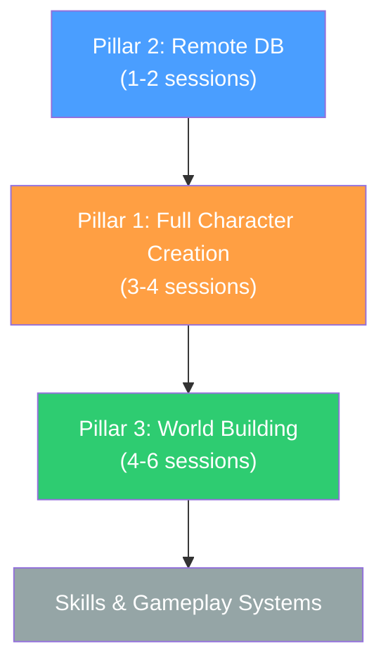

# Next Phase Plan — Beyond the Prototype

**Created:** 2026-02-09  
**Status:** ✅ APPROVED — 2026-02-09  
**Naming Convention:** `Pillar XX, Phase XXX --- 00. Chat title`  
**Context:** The initial prototype (Phases 0–6) proved the MMO spine: connect → login → create character → select character → spawn → see other players. This document plans the **three major next steps** before skills and deeper gameplay get added.

---

## Where We Are Now

| System | Status | What Works |
|--------|--------|-----------|
| Dedicated Server | ✅ | Launches, accepts connections |
| Client Connection | ✅ | Clients connect, see each other |
| PostgreSQL (Local) | ✅ | libpq integrated, subsystem reads/writes |
| Account System | ✅ | Create account, login, password hashing |
| Character Creation (Backend) | ✅ | Validation, DB persistence, rate limiting |
| Character Creation (UI) | ✅ | Sliders, name input, submit flow |
| Character Select + Spawn | ✅ | Select character, spawn in world, see others |

**What's Missing (in order):**
1. Character creation is form-only — no 3D preview, no affinities, limited appearance options
2. Database is local-only — can't share between machines or deploy remotely
3. The "world" is `L_PrototypeWorld` — a flat empty map with nothing in it

---

## The Three Pillars

### Pillar 1: Full Character Creation
### Pillar 2: Remote Database Migration
### Pillar 3: Building the World

> [!IMPORTANT]
> Skills, combat, inventory, crafting, NPCs, and all other gameplay systems come **after** these three pillars are done. The world needs to exist before systems can populate it.

---

## Pillar 1: Full Character Creation

**Goal:** A player should be able to create a character that looks distinct, has a name, and has starting affinities — with a 3D preview during creation.

### What Exists Today
- `FFPMCharacterCreationRequest` with name, body type, skin color, hair style, hair color
- `FPMCharacterCreationValidator` with name + appearance validation
- `UFPMCharacterCreationSubsystem` with DB persistence
- `UFPMCharacterCreationWidget` + `WBP_CharacterCreation` (basic sliders)
- `AFPMPlayerCharacter` with replicated appearance (mannequin placeholder)

### What Needs To Be Added

#### 1A. Affinity System Integration
The game uses a **classless** system with **two fully adjustable affinity pools** — no primary/secondary distinction. All affinities are freely distributable at character creation:

**Playstyle Affinities** (6 categories):
- Martial, Ranged, Magic, Crafting, Social, Survival

**Magical Affinities** (8 elements):
- Fire, Water, Earth, Air, Light, Shadow, Nature, Arcane

**Implementation:**
- Add both affinity pools to `FFPMCharacterCreationRequest`
- Validator enforces: each pool's total = its point budget, each value ≥ 0, no individual value exceeds max
- Persist to a `character_affinities` table (type + points per character)
- UI: Zero-sum point allocation sliders for each pool
- Per [03_Progression_and_Attributes.md](file:///e:/FaldoranPrimeMMO/Documents/Design/03_Progression_and_Attributes.md)

#### 1B. 3D Character Preview
- Create `AFPMCharacterPreviewActor` — a client-only actor for the creation screen
- Spawned in a dedicated "preview" scene or sublevel
- Updates appearance in real-time as sliders change (skin tone material, hair mesh swap)
- Camera orbits the preview (mouse drag to rotate)
- Consider [Mutable/CC5 integration](file:///e:/FaldoranPrimeMMO/Documents/Workflows/CC5_Mutable_Integration.md) or use material parameter changes on the mannequin as a stepping stone

#### 1C. Expanded Appearance Options
- Facial features (morph targets or mesh swaps, up to 8 slots per `Character_Creation_System.md`)
- Voice type selection (index for now, audio preview later)
- Better UI layout — possibly the tabbed design from [CharacterCreation_TabbedUI_Setup.md](file:///e:/FaldoranPrimeMMO/Documents/Workflows/CharacterCreation_TabbedUI_Setup.md)

#### 1D. Database Schema Updates
```sql
-- Affinities table (covers both Playstyle and Magical pools)
-- affinity_pool: 0 = Playstyle, 1 = Magical
-- affinity_type: index within the pool (e.g., 0=Martial, 1=Ranged, ...)
CREATE TABLE character_affinities (
    character_id  UUID REFERENCES characters(character_id) ON DELETE CASCADE,
    affinity_pool SMALLINT NOT NULL,
    affinity_type SMALLINT NOT NULL,
    points        SMALLINT NOT NULL DEFAULT 0,
    PRIMARY KEY (character_id, affinity_pool, affinity_type)
);

-- Expanded appearance columns on characters
ALTER TABLE characters ADD COLUMN facial_features SMALLINT[] DEFAULT '{}';
ALTER TABLE characters ADD COLUMN voice_type SMALLINT NOT NULL DEFAULT 0;
```

> [!NOTE]
> A separate affinities table is the right call since affinities change through gameplay progression (equipment, skill use, quest rewards). The `affinity_pool` column cleanly separates the two pools without needing separate tables.

### Estimated Sessions: 3–4

### Agent Prompts — Pillar 1

#### Pillar 01, Phase 1A --- 01. Affinity Backend
```
CONVERSATION TITLE: Pillar 01, Phase 1A --- 01. Affinity Backend

Read the file Documents/Design/00_Rules_and_Constraints.md for project rules.
Read the file Documents/Design/03_Progression_and_Attributes.md for the affinity system design.
Read the file Documents/Workflows/Prototype_Implementation_Plan.md for prototype context.
Read the file Documents/Workflows/Next_Phase_Plan.md for the current plan.

TASK: Add both affinity pools (Playstyle + Magical) to the character creation backend.

The system is classless — NO primary/secondary distinction. ALL affinities are fully adjustable.

Playstyle Affinities (6): Martial, Ranged, Magic, Crafting, Social, Survival
Magical Affinities (8): Fire, Water, Earth, Air, Light, Shadow, Nature, Arcane

Prerequisites: Phases 0-6 from prototype are complete. UFPMCharacterCreationSubsystem, FPMCharacterCreationDataContract, and FPMCharacterCreationValidator exist.

Do this in micro-steps, one at a time, each must compile:
1. Update FPMCharacterCreationDataContract.h:
   - Add EFPMPlaystyleAffinity enum (Martial, Ranged, Magic, Crafting, Social, Survival)
   - Add EFPMMagicalAffinity enum (Fire, Water, Earth, Air, Light, Shadow, Nature, Arcane)
   - Add TMap<EFPMPlaystyleAffinity, int32> PlaystyleAffinities to FFPMCharacterCreationRequest
   - Add TMap<EFPMMagicalAffinity, int32> MagicalAffinities to FFPMCharacterCreationRequest
2. Update FPMCharacterCreationValidator:
   - ValidatePlaystyleAffinities(): total = point budget, each value >= 0, no value exceeds max
   - ValidateMagicalAffinities(): same rules for the magical pool
   - Add both to ValidateRequest()
3. Create the character_affinities table (provide SQL for pgAdmin):
   - character_id UUID FK, affinity_pool SMALLINT, affinity_type SMALLINT, points SMALLINT
   - PRIMARY KEY (character_id, affinity_pool, affinity_type)
4. Update UFPMCharacterCreationSubsystem::SubmitCharacterCreation() to persist affinities
5. Add console test: FPM.TestCreateCharacterWithAffinities
6. Compile and test

Follow all rules in 00_Rules_and_Constraints.md. No file over 500 lines. Server authority. Never trust client.
```

#### Pillar 01, Phase 1B --- 02. Character Preview
```
CONVERSATION TITLE: Pillar 01, Phase 1B --- 02. Character Preview

Read the file Documents/Design/00_Rules_and_Constraints.md for project rules.
Read the file Documents/Technical/Character_Creation_System.md for architecture.
Read the file Documents/Workflows/Next_Phase_Plan.md for the current plan.

TASK: Create a 3D character preview actor for the character creation screen.

Prerequisites: Pillar 01, Phase 1A complete. Affinity system integrated.

Do this in micro-steps, one at a time, each must compile:
1. Create AFPMCharacterPreviewActor (inherits AActor) in Source/FaldoranPrimeMMO/Public/Character/Preview/ and Private/Character/Preview/
   - Client-only actor (never replicated)
   - USkeletalMeshComponent with UE5 mannequin mesh
   - UMaterialInstanceDynamic for skin tone changes
   - Functions: SetSkinTone(FLinearColor), SetHairStyle(uint8), SetHairColor(FLinearColor), SetBodyType(uint8)
   - Each setter updates the visual immediately
2. Create a preview scene setup:
   - USceneCaptureComponent2D or a dedicated sublevel camera
   - Lighting for the preview (point light + fill light)
3. Add camera orbit controls:
   - Mouse drag rotates the preview actor around Y axis
   - Mouse wheel zooms
4. Wire up to UFPMCharacterCreationWidget:
   - When slider values change, call corresponding setter on the preview actor
   - Preview updates in real-time
5. Compile and test: open character creation → changing sliders updates the 3D preview

Follow all rules in 00_Rules_and_Constraints.md. No file over 500 lines. This is client-only code — no server authority needed.
```

#### Pillar 01, Phase 1C --- 03. Expanded Appearance
```
CONVERSATION TITLE: Pillar 01, Phase 1C --- 03. Expanded Appearance

Read the file Documents/Design/00_Rules_and_Constraints.md for project rules.
Read the file Documents/Technical/Character_Creation_System.md for appearance spec.
Read the file Documents/Workflows/Next_Phase_Plan.md for the current plan.

TASK: Expand the character appearance system with facial features and voice type, plus improve the creation UI layout.

Prerequisites: Pillar 01, Phases 1A-1B complete. Preview actor works.

Do this in micro-steps, one at a time, each must compile:
1. Update FFPMCharacterCreationRequest:
   - Add FacialFeatures (TArray<uint8>, max 8 entries)
   - Add VoiceType (uint8)
2. Update FPMCharacterCreationValidator:
   - ValidateFacialFeatures(): max 8 entries, each valid index
   - ValidateVoiceType(): valid index range
3. Update database: ALTER TABLE characters ADD COLUMN facial_features SMALLINT[] DEFAULT '{}'; ALTER TABLE characters ADD COLUMN voice_type SMALLINT NOT NULL DEFAULT 0;
4. Update UFPMCharacterCreationSubsystem to persist new fields
5. Update AFPMCharacterPreviewActor to apply facial features (morph targets) and display voice type
6. Update UFPMCharacterCreationWidget with new controls:
   - Facial feature sliders/selectors
   - Voice type dropdown
   - Consider reorganizing into tabbed layout
7. Update AFPMPlayerCharacter replicated properties to include facial_features and voice_type
8. Compile and test end-to-end: create character with full appearance → verify in DB → spawn → verify replicated

Follow all rules in 00_Rules_and_Constraints.md. No file over 500 lines. Server authority on validation.
```

---

## Pillar 2: Remote Database Migration

**Goal:** Move PostgreSQL from localhost to your dedicated server machine so multiple machines can connect and you're no longer tied to the dev PC.

### What Exists Today
- PostgreSQL running locally on the dev machine
- Connection config in `DefaultGame.ini` under `[FPM.Database]`
- `UFPMDatabaseSubsystem` connects via `PQconnectdb()` with libpq

### Hosting: Dedicated Server Machine (Decided ✅)
You have a dedicated server machine available. PostgreSQL will run on it directly — full control, zero hosting cost, and both the UE dedicated server and the database can live on the same box.

### Setup Steps

#### 2A. Install PostgreSQL on the Dedicated Server
1. Download and install PostgreSQL 16+ on the server machine
2. During install, note the `data` directory path and set the `postgres` superuser password
3. Verify the service is running: `pg_isready` from the server's command line

#### 2B. Configure for Remote Access
1. Edit `postgresql.conf` → set `listen_addresses = '*'` (or your dev machine's IP)
2. Edit `pg_hba.conf` → add a line allowing your dev machine's IP to connect:
   ```
   host  all  all  YOUR_DEV_IP/32  scram-sha-256
   ```
3. Open port `5432` in the server's Windows Firewall (or Linux equivalent)
4. Restart PostgreSQL service

#### 2C. Create Database and Schema
1. Connect via `psql` on the server: `psql -U postgres`
2. Create the user and database:
   ```sql
   CREATE USER fpm_server WITH PASSWORD 'your_secure_password';
   CREATE DATABASE faldoran_prime OWNER fpm_server;
   ```
3. Run the existing schema from [Database_Schema_v1.sql](file:///e:/FaldoranPrimeMMO/Documents/Technical/Database_Schema_v1.sql)
4. Run the new `character_affinities` table creation (from Pillar 1D above)

#### 2D. Code Changes (Minimal)
The prototype was designed for this — it's mostly a config change:
```ini
[FPM.Database]
Host=YOUR_SERVER_IP
Port=5432
DatabaseName=faldoran_prime
Username=fpm_server
Password=your_secure_password
```

Additional code changes:
- Add connection retry logic (remote connections can drop temporarily)
- Add connection timeout configuration
- Optional: Add SSL mode to the `PQconnectdb()` connection string for encrypted traffic

#### 2E. Security
- Firewall: only allow connections from known IPs on port 5432
- Use a strong password (not `dev_password_change_me`)
- Enable PostgreSQL logging for audit trail
- If the server is on your LAN, LAN-only access is sufficient for now; for WAN access, consider an SSH tunnel

### Estimated Sessions: 1–2

### Agent Prompts — Pillar 2

#### Pillar 02, Phase 2AB --- 04. PostgreSQL Server Setup
```
CONVERSATION TITLE: Pillar 02, Phase 2AB --- 04. PostgreSQL Server Setup

Read the file Documents/Design/00_Rules_and_Constraints.md for project rules.
Read the file Documents/Workflows/Next_Phase_Plan.md for the current plan.

TASK: Walk me through installing and configuring PostgreSQL 16 on my dedicated server machine for remote access.

This is a setup/ops task, not a code task. My dedicated server machine needs:
1. PostgreSQL 16+ installed
2. Configured for remote connections (listen_addresses, pg_hba.conf)
3. Windows Firewall port 5432 opened
4. Database "faldoran_prime" created
5. User "fpm_server" created with appropriate permissions
6. Schema from Documents/Technical/Database_Schema_v1.sql applied
7. New character_affinities table created (see Next_Phase_Plan.md Pillar 1D)
8. Verification that I can connect from my dev machine using psql

Provide step-by-step instructions. Include the exact commands and config file edits.
Include troubleshooting steps for common issues (connection refused, auth failed, etc.).
```

#### Pillar 02, Phase 2DE --- 05. Code Migration
```
CONVERSATION TITLE: Pillar 02, Phase 2DE --- 05. Code Migration

Read the file Documents/Design/00_Rules_and_Constraints.md for project rules.
Read the file Documents/Workflows/Next_Phase_Plan.md for the current plan.

TASK: Update UFPMDatabaseSubsystem to support remote PostgreSQL connections with retry logic and timeout.

Prerequisites: PostgreSQL is installed and accessible on the dedicated server. Pillar 02, Phase 2AB is complete.

Do this in micro-steps, one at a time, each must compile:
1. Update Config/DefaultGame.ini:
   - Change Host from localhost to the server IP
   - Update password to the new secure password
2. Update UFPMDatabaseSubsystem:
   - Add connection timeout parameter to PQconnectdb() connection string (connect_timeout=10)
   - Add retry logic: if connection fails, retry up to 3 times with 2-second backoff
   - Add IsConnectionHealthy() check using PQstatus()
   - Add auto-reconnect if connection is lost during gameplay
   - Optional: add sslmode=prefer to connection string
3. Add console command: FPM.TestRemoteDBConnect — verifies remote connection
4. Compile and test:
   - Launch PIE with dedicated server
   - Verify connection to remote PostgreSQL
   - Test creating an account and character (data appears in remote DB)
   - Test connection recovery (manually restart PostgreSQL, verify reconnect)

Follow all rules in 00_Rules_and_Constraints.md. No file over 500 lines.
```

---

## Pillar 3: Building the World

**Goal:** Replace `L_PrototypeWorld` (flat empty map) with an actual explorable environment that demonstrates the game's biome and terrain system.

This is the biggest pillar and the most creative. Based on [02_World_and_Scale.md](file:///e:/FaldoranPrimeMMO/Documents/Design/02_World_and_Scale.md) and [Technical_Infrastructure.md](file:///e:/FaldoranPrimeMMO/Documents/Technical/Technical_Infrastructure.md), the full vision is an Earth-sized procedurally generated world with hexagonal chunk sharding. **That's production.** For this phase, we need a **playable slice** that proves the world systems work.

### Strategy: The "Starter Island" Approach

Build a single, contained region (~2–5 km²) that showcases:
- Multiple biomes: **Meadows** (starter/spawn), Forest, Mountain, Coast
- Terrain variation (hills, valleys, water)
- Resource nodes (visual cues from [11_Resource_Surveying_and_Geology.md](file:///e:/FaldoranPrimeMMO/Documents/Design/11_Resource_Surveying_and_Geology.md))
- Day/night cycle
- Basic weather
- Spawn points (Meadows biome only)
- At least one POI (a ruin, a mine entrance, or a settlement footprint)

> [!IMPORTANT]
> **Spawn Rule:** Players can **ONLY** spawn in biomes tagged as **Meadows**. The exact spawn location within Meadows zones is **randomized**. This means the Starter Island must have at least one Meadows biome with multiple valid spawn points scattered across it.

### Sub-Phases

#### 3A. Terrain & Landscape
- Create a new map `L_StarterIsland` using UE5 Landscape tools
- Design heightmap with varied elevation (mountains, valleys, flatlands, coast)
- Set up landscape materials with auto-painting (slope-based: grass → rock → snow)
- Water body (ocean around island, at least one river or lake)
- Multiple biome zones using landscape layers

#### 3B. Environment & Atmosphere
- Directional light with day/night cycle (rotating sun)
- Sky atmosphere + volumetric clouds
- Post-process volume for mood (warm day, cool night)
- Fog for distance and atmosphere
- Basic weather system (rain particle effect, wind audio)

#### 3C. Foliage & Natural Objects
- Trees (multiple types per biome: deciduous, coniferous, tropical)
- Grass and ground cover (procedural foliage spawning)
- Rocks and boulders (variety pack)
- Flowers and bushes for biome identity

#### 3D. Resource Nodes (Visual Prototypes)
- Place static mesh actors representing mineable rocks (iron-tinted, copper-patina, etc.)
- These are **visual only** for now — no interaction system yet
- Follow the "tell" system from [11_Resource_Surveying_and_Geology.md](file:///e:/FaldoranPrimeMMO/Documents/Design/11_Resource_Surveying_and_Geology.md)
- At minimum: iron, copper, coal, and wood (trees) as distinct visual types

#### 3E. Points of Interest
- At least one handcrafted POI:
  - An ancient ruin (static meshes arranged architecturally)
  - OR a mine entrance (demonstrates future dungeon system)
  - OR a settlement footprint (flat area with placeholder market stalls)
- This proves the "Handcrafted Layer" concept from `Technical_Infrastructure.md`

#### 3F. Player Spawn & Navigation
- Create a `Meadows` biome zone with multiple `PlayerStart` actors scattered throughout
- Spawn logic: server picks a random `PlayerStart` that is within a Meadows-tagged volume
- Other biomes (Forest, Mountain, Coast) have **no** spawn points — players must walk to them
- Basic nav mesh for future NPC pathfinding
- Collision on all terrain and objects
- Kill volume under the world (fall-off protection)

#### 3G. World Chunk Foundation (Optional Advanced)
- If time allows, set up the hexagonal chunk concept using World Partition or Level Streaming
- This is forward-looking prep for the procedural generation system
- Not required for the playable slice but sets up the architecture

### Estimated Sessions: 4–6

> [!TIP]
> **Asset Strategy:** UE5 Marketplace has free packs (Quixel Megascans via Fab) that provide photorealistic rocks, trees, and foliage. Using these for the prototype world saves weeks of art time. The custom art pipeline can replace them later.

### Agent Prompts — Pillar 3

#### Pillar 03, Phase 3A --- 06. Terrain and Landscape
```
CONVERSATION TITLE: Pillar 03, Phase 3A --- 06. Terrain and Landscape

Read the file Documents/Design/00_Rules_and_Constraints.md for project rules.
Read the file Documents/Design/02_World_and_Scale.md for world design.
Read the file Documents/Workflows/Next_Phase_Plan.md for the current plan.

TASK: Walk me through creating the Starter Island terrain in UE5.

This is primarily an editor task. I need step-by-step instructions to:
1. Create a new map L_StarterIsland in Content/Maps/
2. Create a Landscape (~2-5 km²) using UE5 Landscape tools
   - Heightmap with varied elevation: mountains in the center/north, valleys, flatlands (Meadows), coastal edges
   - At least 4 distinct biome zones: Meadows, Forest, Mountain, Coast
3. Set up landscape material with auto-painting:
   - Grass layer for Meadows (flat, gentle terrain)
   - Forest floor layer (under tree canopy)
   - Rock layer (steep slopes, mountains)
   - Sand/dirt layer (coast, beaches)
   - Auto slope-based blending
4. Add water:
   - Ocean around the island using UE5 Water system
   - At least one river or lake inland
5. Mark biome boundaries (volume actors or tags) so the spawn system knows which zones are Meadows

Provide exact UE Editor steps: which menus, which settings, which values.
The Meadows biome should be the largest flat area — this is where players spawn.
```

#### Pillar 03, Phase 3B --- 07. Atmosphere and Lighting
```
CONVERSATION TITLE: Pillar 03, Phase 3B --- 07. Atmosphere and Lighting

Read the file Documents/Design/00_Rules_and_Constraints.md for project rules.
Read the file Documents/Workflows/Next_Phase_Plan.md for the current plan.

TASK: Set up the day/night cycle, sky, and weather for L_StarterIsland.

Prerequisites: Pillar 03, Phase 3A complete. L_StarterIsland terrain exists.

Walk me through (editor steps + any C++ needed):
1. Day/Night cycle:
   - Directional light that rotates over time (sun)
   - Blueprint or C++ actor that controls rotation speed (1 in-game day = configurable real minutes)
   - Moon light for nighttime
2. Sky and atmosphere:
   - SkyAtmosphere component
   - Volumetric clouds
   - Sky colors change with sun angle (dawn, noon, dusk, night)
3. Post-processing:
   - PostProcessVolume for the map
   - Warm tones during day, cool blue tones at night
   - Auto-exposure for indoor/outdoor transitions
4. Fog:
   - ExponentialHeightFog for atmosphere and distance haze
   - Denser fog near water/coast
5. Basic weather:
   - Rain particle system (Niagara) that can be toggled
   - Wind audio (ambient sound)
   - Weather does NOT need gameplay effects yet — just visual/audio

Provide exact steps. For any C++ classes, follow all rules in 00_Rules_and_Constraints.md.
```

#### Pillar 03, Phase 3C --- 08. Foliage and Environment
```
CONVERSATION TITLE: Pillar 03, Phase 3C --- 08. Foliage and Environment

Read the file Documents/Design/00_Rules_and_Constraints.md for project rules.
Read the file Documents/Workflows/Next_Phase_Plan.md for the current plan.

TASK: Populate L_StarterIsland with foliage, trees, rocks, and natural objects per biome.

Prerequisites: Pillar 03, Phases 3A-3B complete. Terrain and atmosphere exist.

Walk me through:
1. Foliage setup:
   - Set up UE5 Procedural Foliage system
   - Biome-appropriate foliage types:
     * Meadows: grass, wildflowers, scattered bushes
     * Forest: dense trees (deciduous + coniferous mix), undergrowth, ferns
     * Mountain: sparse shrubs, alpine grass, exposed rock
     * Coast: beach grass, driftwood, palm-like trees
2. Tree placement:
   - Use foliage painting tool or procedural foliage spawner
   - Multiple tree meshes per biome for variety
   - Proper LOD settings for performance
3. Rocks and boulders:
   - Scatter placement in Mountain and Forest zones
   - Variety of sizes
4. Performance:
   - Foliage culling distances
   - HLOD setup if needed
   - Target: stable 60fps with foliage visible

Use free assets from Fab/Quixel Megascans where possible. Provide exact asset names or download instructions.
```

#### Pillar 03, Phase 3DE --- 09. Resources and POIs
```
CONVERSATION TITLE: Pillar 03, Phase 3DE --- 09. Resources and POIs

Read the file Documents/Design/00_Rules_and_Constraints.md for project rules.
Read the file Documents/Design/11_Resource_Surveying_and_Geology.md for resource visual cues.
Read the file Documents/Workflows/Next_Phase_Plan.md for the current plan.

TASK: Place visual resource nodes and at least one POI on L_StarterIsland.

Prerequisites: Pillar 03, Phases 3A-3C complete. Terrain, atmosphere, and foliage exist.

Do this in micro-steps:
1. Create visual resource node actors (visual only, no interaction yet):
   - Iron nodes: red-tinted rock meshes, placed in Mountain biome
   - Copper nodes: greenish-patina rock meshes, placed near Forest/Mountain border
   - Coal nodes: dark crumbling shale, placed near rivers/ravines
   - Wood: trees already placed in Forest (no special actor needed)
   - Follow the "tell" system from 11_Resource_Surveying_and_Geology.md
2. Create at least one POI:
   - Option A: Ancient ruin (static meshes arranged as crumbling walls, columns, an altar)
   - Option B: Mine entrance (cave opening in mountainside)
   - Option C: Settlement footprint (flat cleared area with placeholder market stalls)
   - Choose whichever is most achievable with available assets
3. Place the POI on the map in a discoverable but not obvious location
4. Add basic collision to all placed objects

For C++ resource actors: follow all rules in 00_Rules_and_Constraints.md. No file over 500 lines.
These are VISUAL ONLY — no interaction, no inventory, no gathering. Just proof of the world concept.
```

#### Pillar 03, Phase 3F --- 10. Spawn System and Polish
```
CONVERSATION TITLE: Pillar 03, Phase 3F --- 10. Spawn System and Polish

Read the file Documents/Design/00_Rules_and_Constraints.md for project rules.
Read the file Documents/Workflows/Next_Phase_Plan.md for the current plan.

TASK: Implement Meadows-only randomized spawning and final world polish.

Prerequisites: Pillar 03, Phases 3A-3E complete. Full Starter Island exists with biomes, atmosphere, foliage, resources, and POIs.

IMPORTANT SPAWN RULE: Players can ONLY spawn in Meadows biome zones. Spawn location is RANDOMIZED among valid Meadows spawn points.

Do this in micro-steps, one at a time, each must compile:
1. Create biome volume actors:
   - AFPMBiomeVolume (inherits AVolume) with a BiomeType enum (Meadows, Forest, Mountain, Coast)
   - Place volumes over each biome zone in L_StarterIsland
2. Place multiple PlayerStart actors within the Meadows volume(s)
   - Scatter them across the Meadows area (at least 8-10 spawn points)
   - Ensure they are on solid ground, not overlapping objects
3. Update AFPMGameMode:
   - Override ChoosePlayerStart() or FindPlayerStart()
   - Filter PlayerStarts to only those inside a Meadows-tagged biome volume
   - Randomly select from valid Meadows spawns
4. Add kill volume under the world (fall-off protection)
5. Add basic nav mesh for future NPC pathfinding
6. Update DefaultEngine.ini to set L_StarterIsland as the new default map (replacing L_PrototypeWorld)
7. Compile and test:
   - Launch PIE with 2+ players
   - Verify all players spawn in Meadows area (different random locations)
   - Verify players can walk to Forest, Mountain, and Coast biomes
   - Verify players can see each other
   - THIS IS THE PILLAR 3 MILESTONE 🎉

Follow all rules in 00_Rules_and_Constraints.md. No file over 500 lines. Server authority — server picks spawn point.
```

---

## Recommended Order of Execution



**Rationale for this order:**
1. **Remote DB first** — Quick win (1–2 sessions), unblocks multi-machine testing early, and every other pillar benefits from database access being stable and remote.
2. **Character creation second** — Builds on the existing code, adds depth to the player experience before they enter the world.
3. **World building last** — The biggest creative effort. By the time you start this, account/character systems are rock solid and you can focus purely on the world.

**Alternative:** If you're itching to see something visual, you could do World Building first (3A–3C terrain and atmosphere) in parallel with Remote DB, since terrain work is mostly editor-side and doesn't touch the codebase.

---

## What Comes After These Three Pillars

Once a player can create a real character, connect to a remote database, and walk around a real world, the next layer is **gameplay systems:**

1. **Skills & Abilities** — Per [13_Skills_and_Abilities.md](file:///e:/FaldoranPrimeMMO/Documents/Design/13_Skills_and_Abilities.md)
2. **Resource Gathering** — Interact with the visual resource nodes placed in Pillar 3
3. **Inventory System** — Store gathered resources
4. **Crafting** — Per [10_Dynamic_Crafting_and_Templates.md](file:///e:/FaldoranPrimeMMO/Documents/Design/10_Dynamic_Crafting_and_Templates.md)
5. **Building** — Per [05_Building_and_Settlements.md](file:///e:/FaldoranPrimeMMO/Documents/Design/05_Building_and_Settlements.md)
6. **Combat** — Per [06_Gear_and_Combat.md](file:///e:/FaldoranPrimeMMO/Documents/Design/06_Gear_and_Combat.md)
7. **Node System** — Per [AshesOfCreation_Inspiration.md](file:///e:/FaldoranPrimeMMO/Documents/Research/AshesOfCreation_Inspiration.md) §1

But all of that lives on top of the three pillars above. Get the foundation right first.

---

*Estimated total: 8–12 sessions (~20–30 hours) to complete all three pillars.*
